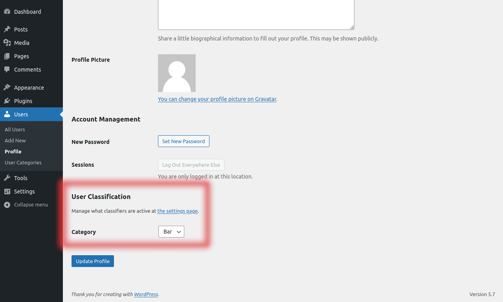
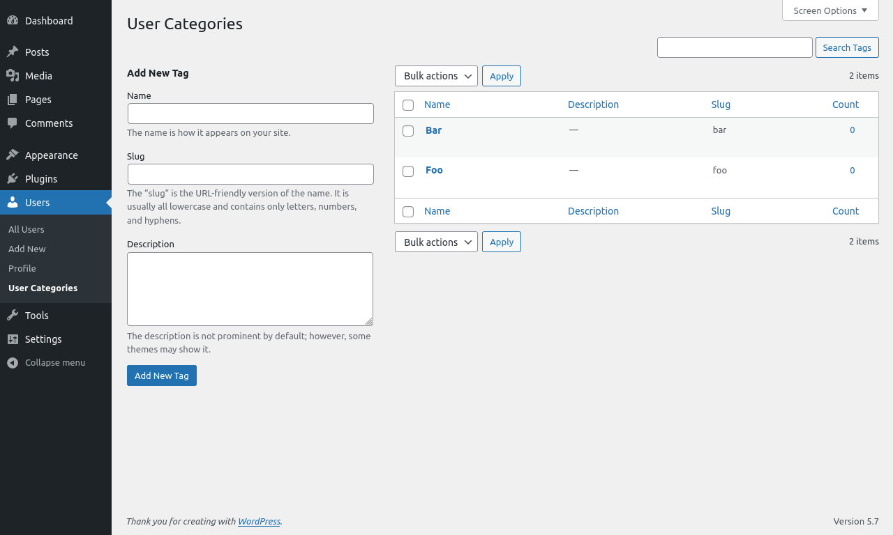
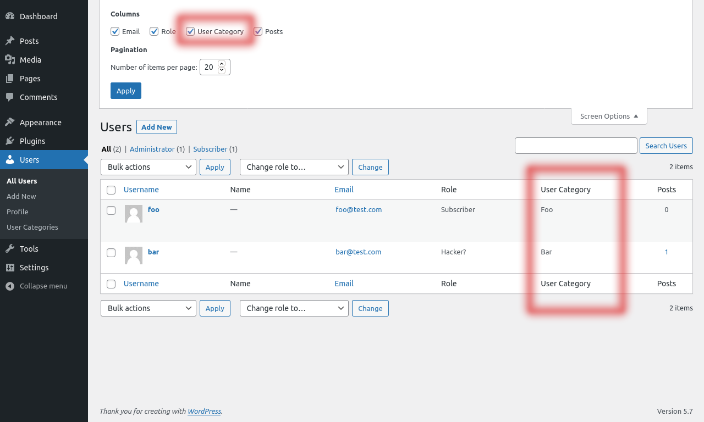
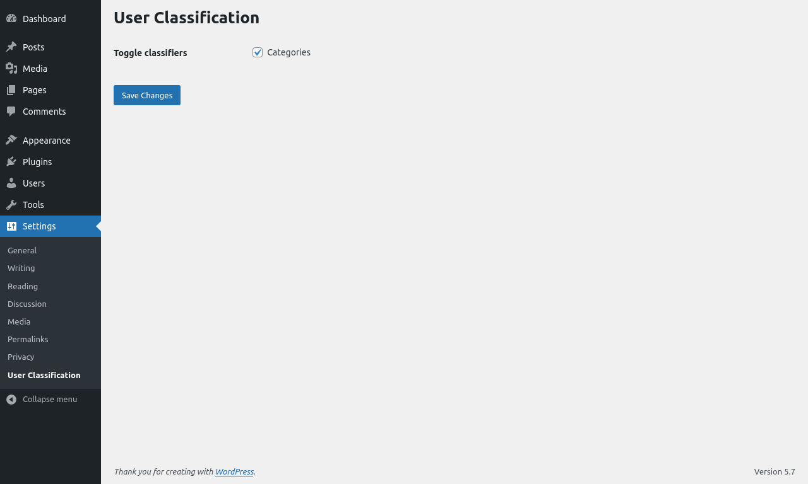

# User Classification

Contributors: lsvh  
Donate link: https://github.com/LSVH/wp-user-classification  
Tags: users, administration  
Requires PHP: 7.0  
Requires at least: 5.0  
Tested up to: 5.7.2  
Stable tag: 0.1.5  
License: GPLv2 or later  
License URI: http://www.gnu.org/licenses/gpl-2.0.html

Classify an WordPress user.

## Description

This plugin helps you classify your [WordPress users](https://learn.wordpress.org/lesson-plan/user-management/).

### Features

The plugin currently supports the following classifiers:

* Categorize your users.

The plugin comes with a settings page where you can specify which classifiers you want to enable.

### Capabilities

As an WordPress Admin its understandable that not all users can read and/or edit their own or someone else their user classification. That's why this plugin comes with the following capabilities:

* `read_user-classification` : The user will be allowed to read all user classifications.
* `read_own_user-classification` : The user will be allowed to read their own user classifications.
* `edit_user-classification` : The user will be allowed to read and edit all user classifications.
* `edit_own_user-classification` : The user will be allowed to read and edit their own user classifications.

### Usage

This section describes how to install the plugin and get it working.

1. Add the plugin to your wordpress environment.
2. Activate the plugin through the 'Plugins' menu in WordPress.
3. Go to the 'Settings' tab and click on the 'Media Scraper' sub-menu item.
4. Toggle the classifiers which you would like to use.
5. Go to a WordPress user and specify how you want to classify the user.

Note: when using the classifier "Categories", make sure you defined categories in "Users > User Categories".

## Screenshots

1. The User Classification section on the user page.  
   
2. The User Category displayed on the users page.  
   
4. The User Categories taxonomy.  
   
6. The plugin's settings page.  
   

## Frequently Asked Questions

### Where can I classify an user?

At the user edit page. But make sure you have the right capabilities to do so and that there are classifiers active.

### Why I cannot edit the user's/my classifiers?

Your user might not have the right capabilities to edit the classifiers.

## Issues & Contributions

Please submit issues or your contributions for this plugin on the [Github Repository](https://github.com/LSVH/wp-user-classification).

## Changelog

### 0.1.5
